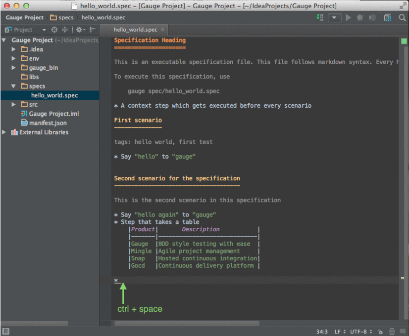
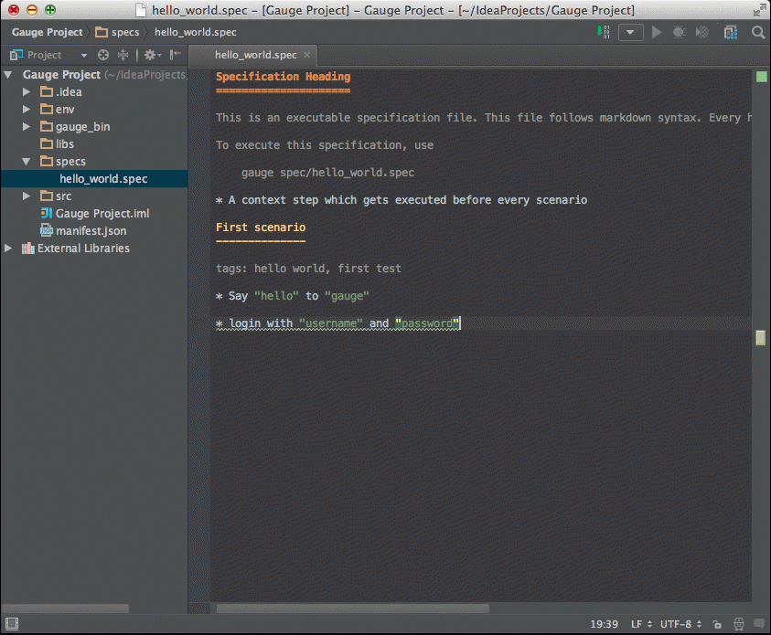
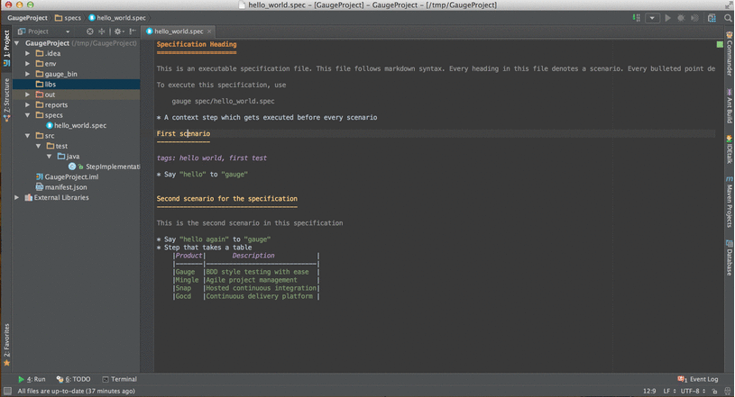
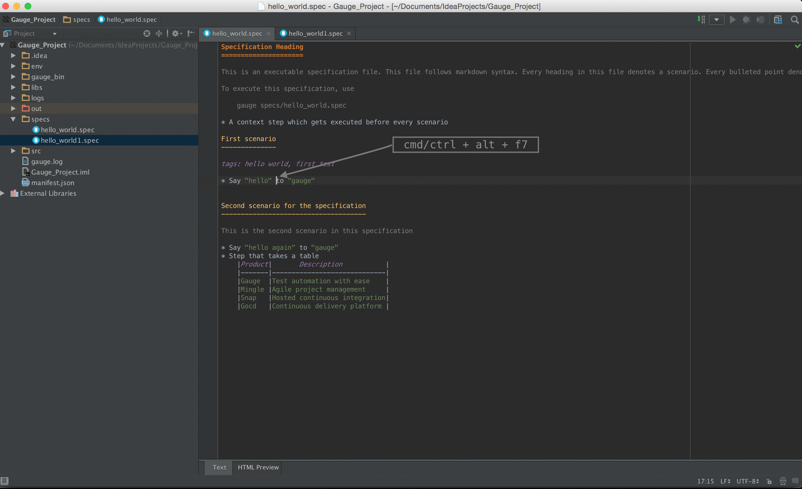
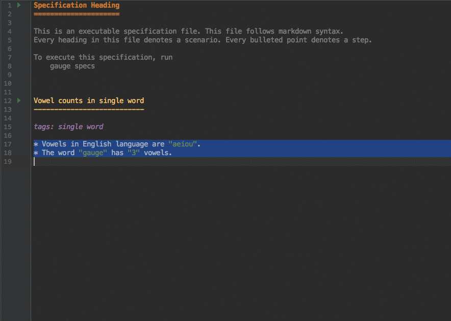

Intellij support for [Gauge](https://github.com/getgauge/gauge) project.

[](https://github.com/getgauge/Intellij-Plugin/actions)
[](CODE_OF_CONDUCT.md)

## Deprecation Notice
*[VS Code](https://code.visualstudio.com/) has good support for Java and the [Gauge VS Code](https://github.com/getgauge/gauge-vscode/) works great with the [Gauge java plugin](https://github.com/getgauge/gauge-java). We are deprecating the IntelliJ Gauge plugin in favour of the [Gauge VS Code plugin](https://github.com/getgauge/gauge-vscode/).*

*The Gauge team will stop addding new features to the IntelliJ Gauge plugin, only bug fixes will be done henceforth. The Gauge team will officially end support for IntelliJ Gauge plugin in October 2020.*

*If you wish to take up owership of this plugin, please contact us. We would be happy to transfer the plugin ownwership.*

# Building from Source

```
> git clone git@github.com:getgauge/Intellij-Plugin.git
> cd Intellij-Plugin
> ./gradlew buildPlugin
```

The plugin zip will be available at `build/distributions`. Install the zip file from [IntelliJ IDEA](https://www.jetbrains.com/help/idea/2017.1/installing-a-plugin-from-the-disk.html)

# Installation

Plugin can be installed by downloading from Jetbrains plugin repository.

Steps to install Gauge Intellij IDEA plugin from IDE:

-  Open the Settings dialog (e.g. ⌘ Comma).
-  In the left-hand pane, select Plugins.
-  On the Plugins page that opens in the right-hand part of the dialog,
   click the Install JetBrains plugin or the Browse repositories button.
-  In the dialog that opens, search for Gauge. Right-click on **Gauge**
   and select Download and Install.

   

-  Confirm your intention to download and install the selected plugin.
-  Click Close.
-  Click OK in the Settings dialog and restart IntelliJ IDEA for the
   changes to take effect.

*Note: The plugin you have installed is automatically enabled. When
necessary, you can disable it as described in Enabling and Disabling
plugins.*

To install plugin by downloading it manually or to update plugin, follow
the steps
[here](https://www.jetbrains.com/help/idea/2017.1/installing-a-plugin-from-the-disk.html).

Create a new Gauge project and start writing your tests.

Explore all the [features of Gauge Intellij IDEA plugin](#features) now!

## Creating a Java project

-  File -> New Project.
-  Choose 'Gauge'
-  Choose the project location and java sdk
-  Finish

*Note: If `gauge-java` is not installed, it will download it for the
first time.*


## Maven project using gauge-maven-plugin

-  File -> New Project
-  Choose `Maven`
-  Select `Create from Archetype`
-  Select the gauge archetype - `com.thoughtworks.gauge.maven`
-  If the `com.thoughtworks.gauge.maven` archetype is not added select
   `Add Archetype`

   -  Enter GroupId: com.thoughtworks.gauge.maven
   -  Enter ArtifactId: gauge-archetype-java
   -  Enter Version: 1.0.1 or the `latest version
      number from https://repo1.maven.org/maven2/com/thoughtworks/gauge/maven/gauge-archetype-java/


   **maven add archetype**

-  Enter the `groupId` and `artifactId` for your project.
-  Enter `Project Name` and finish
-  The project will be created in batch mode, watch the console for
   progress.
-  After project creation `close and re-open the project` to enable
   auto-complete features.
-  Enable `auto-import` for the project. Under
   `File > Settings > Maven > Importing`, mark the checkbox
   `Import Maven projects automatically`.

See [gauge-maven-plugin](https://docs.gauge.org/configuration.html#maven) for more details on using the gauge maven plugin.


# Features
* [Syntax Highlighting](#syntax-highlighting)
* [Auto Completion](#auto-completion)
* [Quick fix](#quick-fix)
* [Navigation](#navigation)
* [Formatting](#formatting)
* [Execution and Debugging](#execution)
* [Rephrase Steps](#rephrase-steps)
* [Find Usages](#find-usages)
* [Extract Concept](#extract-concept)
* [Create Spec and Concept files](#create-spec-and-oncept-files)
* [Templates](#templates)
* [HTML Preview](#html-preview)

## Syntax Highlighting

Specifications, Scenarios, Steps and Tags are highlighted. Steps with missing implementation are also highlighted.


   

## Auto Completion

Steps present in the current project can be listed by invoking the auto
completion pop up `ctrl+space` after the '\*'.



## Quick fix



## Navigation

Usage: `right Click` -> `Go to` -> `Declaration`

## Formatting

A specification file can be formatted easily using the keyboard
shortcut of `Spec Format` in the action menu `ctrl+shift+a`.

This formats the specification including indentation of tables and
steps.

## Execution

-  Specs can be executed by `right click -> Run spec`.
-  Execute all specs inside a directory by
   `right click -> Run specifications`

### Single Scenario Execution

A single scenario can be executed by doing a right click on the scenario
which should be executed and choosing the scenario.
`right click -> run -> Scenario Name`

.. note:: If the right click is done in context other than that of
scenario, by default, first scenario will be executed.



### Parallel Execution

To run multiple specifications in parallel

-  Right click on the `specs` directory and select
   `Create Specifications` option.
-  In the new Run configuration select `In Parallel` options. This
   will distribute specs execution based on number of cores the machine
   has.
-  You can also specify the `Number of parallel execution streams`.

*Select parallel nodes based on current systems performance.
For example on a 2 core machine select upto 4 parallel streams.
A very large number may affect performance.*

-  Select ``ok``. Now you can run this new configuration for parallel
   execution of specs.

### Debugging

Debugging can be performed the same way spec execution works.

-  Right click on a specification or specs directory -> Debug. Execution
   will halt on marked [breakpoints](https://www.jetbrains.com/idea/help/breakpoints.html).

### Run Configuration

You can edit the run configuration to make changes to:

    - The scenario or spec file to be executed
    - Choose table-rows to be executed
    - The environment to run against
    - Add a tag filter to the execution
    - Choose the number of parallel streams
    - Add program arguments (Example: --log-level)


### Multiple Spec Files Execution

To execute multiple specs/scenarios add ``||`` seperated list of spec/scenarios in `Specification to execute` section


*The delimiter for multiple spec files in run config has been changed from comma (``,``) to double bar (``||``). Until v0.1.0 of IntelliJ plugin, the delimiter is ``,``. Any higher version will have delimiter ``||``.*

## Rephrase Steps

- ``right click -> Refactor -> Rename`` on a step to rephrase it.
-  The parameters will be in ``< >`` in the rephrase dialog. They can be
   reordered,removed or new parameters can be added.
-  The rephrase change will reflect across **all the specs** in the
   project.

## Find Usages

-  `right click -> Find Usages` on step/concept to see the usages.



## Extract Concept

-  In the editor, select the steps to be transformed into a concept.
-  On the main menu or on the context menu of the selection, choose
   `Refactor | Extract to Concept` or press `⌥⌘C`.
-  In the Extract Concept dialog box that opens

   -  Specify the concept name with parameters to be passed from the
      usage. Example: Say "hello" to "gauge".
   -  Select the file name from the spec file dropdown list or specify
      the new file name/path relative to the project.
   -  Click OK.

-  The selected steps will be replaced with the specified concept name.


The intellij idea gauge plugin comes with more features to simplify
writing specifications.

## Create Spec and Concept files

-  You can right-click in under any directory in the specs directory and
   create a new
   [specification](https://docs.gauge.org/syntax.html#specification) or [concept](https://docs.gauge.org/syntax.html#concept) file. They will be
   created with a template to get you started.


## Templates

-  To easily create markdown tables in specification(.spec) or
   concept(.cpt) files you can use predefined table templates specifying
   the number of columns needed.

For example, to create a table with 4 columns type


Then fill the column names in the template.


-  To write the specification heading in markdown, you can use the
   predefined heading template.


Then fill the specification name in the template.


-  Scenario heading in markdown can be easily written using the
   predefined scenario heading template.


Then fill the scenario name in the template.


## HTML Preview

-  A specification file, written in markdown can be viewed as HTML in browser.

This is a spec file in markdown.


Press `alt + F2` or right click and select `open in Browser` option. It gives option to choose a browser.
On choosig a browser, it opens a browser window with HTML equivalent preview of spec file.


Since specs are written in markdown, they can be converted to HTML using
any markdown to HTML convertors.

License
-------

[Apache License, Version 2.0](https://www.apache.org/licenses/LICENSE-2.0)

Copyright
---------

Copyright (c) ThoughtWorks, Inc.
